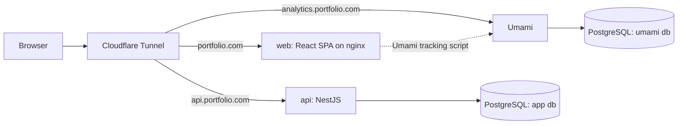

## Portfolio Fullstack Monorepo (Proposal B)

Stack: Vite + React + TypeScript SPA, NestJS + Prisma + PostgreSQL API, self-hosted Umami analytics, Docker Compose, Cloudflare Tunnel. Built phase by phase so each layer is understandable on its own.

### Target repository layout (`/home/joelito/about-me`)

- `apps/web/` - Vite React SPA (TypeScript, Tailwind, react-router, i18next EN/PT/PL)
- `apps/api/` - NestJS API (Prisma, PostgreSQL, class-validator, helmet, rate limiting)
- `packages/shared/` - Shared TypeScript types/DTOs used by both web and api
- `infra/` - `docker-compose.yml`, `web.Dockerfile`, `api.Dockerfile`, `cloudflared/config.yml`, `postgres/init.sql`
- Root: `pnpm-workspace.yaml`, `package.json`, `tsconfig.base.json`, ESLint/Prettier config, `.gitignore`, `README.md`

Tooling choice: **pnpm workspaces** (disk-efficient on the Pi, market-relevant). One shared TS/ESLint/Prettier baseline for consistency.

### Architecture

Cloudflare Tunnel ingress maps subdomains straight to containers, so no separate reverse proxy is needed and no ports are opened on the home router.

## Progress Tracker

Mark a phase `[x]` once you've reviewed and accepted it as done. I'll leave these unchecked until you tell me to check them off. Each phase has its own detailed plan in [`phases/`](phases/).

- [ ] **Phase 0** - [Repo and tooling scaffolding](phases/phase-0/plan.md) ([spec](phases/phase-0/spec.md))
- [ ] **Phase 1** - [Frontend SPA (`apps/web`)](phases/phase-1/plan.md) ([spec](phases/phase-1/spec.md))
- [ ] **Phase 2** - [Backend API (`apps/api`)](phases/phase-2/plan.md) ([spec](phases/phase-2/spec.md))
- [ ] **Phase 3** - [Analytics (Umami)](phases/phase-3/plan.md) ([spec](phases/phase-3/spec.md))
- [ ] **Phase 4** - [Dockerization (`infra`)](phases/phase-4/plan.md) ([spec](phases/phase-4/spec.md))
- [ ] **Phase 5** - [Deployment on the Pi + Cloudflare Tunnel](phases/phase-5/plan.md) ([spec](phases/phase-5/spec.md))
- [ ] **Phase 6** - [CI/CD and hardening](phases/phase-6.md)

### Phases

Detailed, self-contained plans live in the [`phases/`](phases/) directory. This file stays a high-level overview; open a phase file for its goal, steps, deliverables, and task checklist.

- [Phase 0 - Repo and tooling scaffolding](phases/phase-0/plan.md) — [technical spec](phases/phase-0/spec.md)
- [Phase 1 - Frontend SPA (`apps/web`)](phases/phase-1/plan.md) — [technical spec](phases/phase-1/spec.md)
- [Phase 2 - Backend API (`apps/api`)](phases/phase-2/plan.md) — [technical spec](phases/phase-2/spec.md)
- [Phase 3 - Analytics (Umami)](phases/phase-3/plan.md) — [technical spec](phases/phase-3/spec.md)
- [Phase 4 - Dockerization (`infra`)](phases/phase-4/plan.md) — [technical spec](phases/phase-4/spec.md)
- [Phase 5 - Deployment on the Pi + Cloudflare Tunnel](phases/phase-5/plan.md) — [technical spec](phases/phase-5/spec.md)
- [Phase 6 - CI/CD and hardening](phases/phase-6.md)

### Testing strategy

Unified on **Vitest** across the monorepo, following a test pyramid (many unit, fewer integration, few E2E):

- **Unit / component** - Vitest everywhere. Web adds React Testing Library + `@testing-library/jest-dom` + `jsdom`.
- **API integration (HTTP)** - Supertest against the booted NestJS app.
- **DB integration** - Testcontainers (ephemeral PostgreSQL) so tests hit a real database. Chosen deliberately since the whole project is Docker-based (Docker is available locally, in CI, and on the Pi).
- **End-to-end** - Playwright (web against the running stack).
- **Coverage** - `@vitest/coverage-v8` with thresholds; enforced in CI (Phase 6).

Conventions: co-locate unit tests as `*.test.ts(x)` beside source; per-app integration tests in `test/`; E2E in `apps/web/e2e/`. The testing foundation (root Vitest workspace + shared package test) is established in Phase 0; each app phase adds its own layers.

### Notes / decisions made

- pnpm workspaces, Tailwind, react-router, i18next, TanStack Query are sensible defaults; easy to swap if you prefer alternatives.
- Single Postgres container hosting two databases (app + Umami) to stay light on the Pi.
- No separate reverse proxy; Cloudflare Tunnel ingress handles subdomain routing.
- **Vitest** is the single test runner for the whole repo (incl. the NestJS API) for config/tooling consistency; Jest + Supertest is the fallback if Nest + Vitest friction appears.
